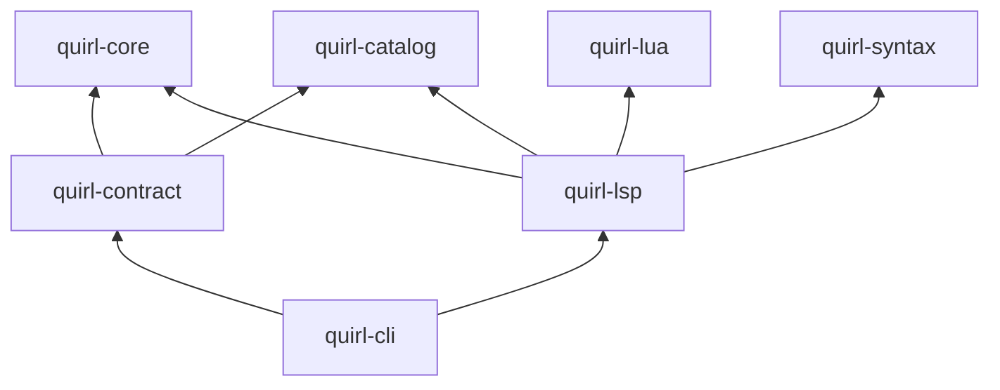

# ADR 0004: Phase 2 contract and language-service layers

- Status: Accepted
- Date: 2026-08-15
- Extends: [ADR 0002](0002-crate-layering.md)

## Context

Phase 2 adds two independently reusable responsibilities that do not belong in
the CLI and cannot be placed in a foundation crate without reversing existing
dependency arrows:

- stable, versioned agent and package schemas, deterministic context selection,
  and package metadata quality gates; and
- deterministic language-server protocol/state/framing plus projections of the
  installed command catalog and Lua host API.

The agent/package contracts consume the semantic catalog but must not depend on
the Lua runtime. The language service needs both catalog metadata and Lua's
public, non-executing validation/`HOST_API` surface. Neither responsibility owns
terminal UI, process execution, or application startup.

## Decision

Add two one-way product layers:

`quirl-contract` owns deny-unknown agent/package schemas, deterministic hashes
and token budgets, non-executing validation, and public-command package quality
gates. The CLI adapts the installed Lua `HOST_API` into contract-owned values;
this keeps `quirl-contract` independent of `quirl-lua` and prevents a reverse
edge into the runtime.

`quirl-lsp` owns deterministic protocol framing and state, generated metadata
projections, and structural native Quirl diagnostics (`.qrl` canonical, with
`.quirl` and `.🌀` accepted aliases). It may call the public
`LuaRuntime::check_source` path, which parses and validates without evaluating
document text, and reuses `quirl-syntax` for the same structural native Quirl
diagnostics as the CLI. It does not depend on `quirl-ui`, `quirl-cli`,
`quirl-process`, or `quirl-data`.

`quirl-cli` remains the sole composition root. It supplies the installed
catalog and host definitions, performs requested filesystem I/O, selects text
or JSON presentation, and launches the stdio language server.

No foundation crate depends on either new layer.

## Consequences

- Agent and package schemas can be tested without terminal or runtime setup.
- Package validation can prove metadata completeness without executing Lua or
  contacting a registry.
- The installed `HOST_API` remains the single Lua capability source while the
  contract crate stays runtime-independent.
- Editor protocol behavior can evolve independently from the shell UI while
  still deriving completion and validation facts from product sources.
- A future consumer other than the CLI may reuse either layer by providing the
  same explicit catalog/host inputs; it may not reach upward into application
  state.
