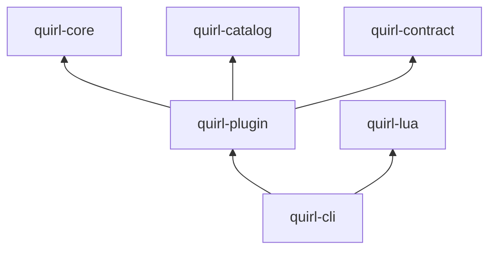

# ADR 0005: Plugin platform state and isolation boundary

- Status: Accepted
- Date: 2026-08-15
- Extends: [ADR 0002](0002-crate-layering.md), [ADR 0004](0004-phase-2-contract-and-language-service-layers.md)

## Context

Phase 3 introduces installed-plugin state, permission grants, supply-chain
checksums, and portable isolation contracts. Those responsibilities are not
Lua implementation details and do not belong in the semantic catalog or CLI.
They need deterministic tests without constructing a VM or touching user
files. The design does not yet select a production Wasm engine or WIT toolchain,
so importing a large runtime would prematurely freeze an open architectural
question.

## Decision

Add `quirl-plugin` as a product layer with one-way dependencies on
`quirl-core`, `quirl-catalog`, and `quirl-contract`:

`quirl-plugin` owns versioned deny-unknown plugin and lockfile values,
cryptographic source checksums, requested/granted permission diffs, pure
copy-on-validate state transitions, doctor reports, and non-executing Wasm
component/out-of-process boundary validation. It does not read or write files,
fetch sources, execute adapters, render UI, or construct language runtimes.

The CLI remains the composition root. It resolves explicitly supplied local
sources, performs atomic lockfile replacement with a recoverable backup,
adapts trusted Lua registrations, and selects text or JSON output. Remote
source fetching is deliberately absent from platform v0.1.

`quirl-lua` remains dependent only on `quirl-core` among Quirl crates. It
accepts explicit string capability grants at construction and exposes
Rust-validated, budgeted registration/callback APIs. It does not parse plugin
manifests or lockfiles. No native Rust plugin ABI is introduced.

The Wasm boundary uses `wasmparser` to validate the complete component and its
exact WIT host import/guest export, binds the checked-in world hash into lock
schema v2, and checks non-zero memory/fuel/deadline budgets without executing
code. Non-executing runtimes cannot be enabled. The out-of-process boundary
similarly validates a relative executable,
protocol version, message limit, and deadline. A future engine or adapter
process requires a separate ADR covering WIT, resource enforcement, and
crash/cancellation behavior.

## Consequences

- Permission escalation and source tampering are rejected before activation.
- State transitions can be validated completely before the CLI replaces the
  current lockfile; failed candidates preserve the last-known-good state.
- Wasm and process isolation remain honest, stable adapter contracts rather
  than simulated execution.
- SHA-256 is an intentional new dependency for supply-chain integrity;
  FNV-based schema fingerprints remain identity checks, not authenticity.
- Phase 3 panels, live pipelines, reference-shell runners, and Windows job
  control remain independent deliverables; this layer does not imply their
  completion.
