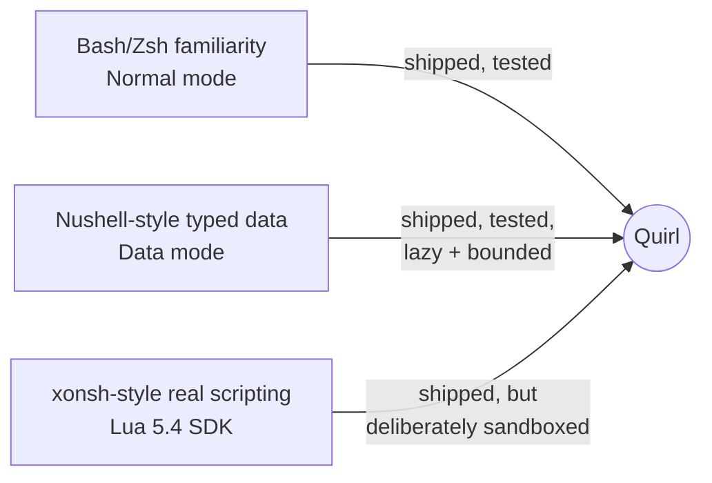

This is the first post on this blog, so it gets the origin story. Quirl went from an empty git repository to a tagged `v0.1.0` release in nine days — August 15 to August 24, 2026 — built by one person leaning hard on three different AI coding tools. I wanted to write down how that actually happened while the numbers are still fresh, because they're stranger than I expected even having lived through it.

## The scale, first

Before the story, the receipts. Everything below is measured directly from the repository and from real usage exports, not estimated:

| | |
| --- | --- |
| Product crates | 13 |
| Lines of Rust | 115,283 |
| Tests | 1,059 (plus 74 more in the release tooling) |
| Architecture decision records | 26 |
| Tracked source size | ~32 MiB |
| Total commits | 299 |
| Elapsed time | 9 days |

Thirteen crates with an enforced one-way dependency graph, twenty-six written-down architecture decisions, a thousand-plus tests, a generated Lua SDK, a language server, an MCP surface, a terminal UI with a tested fail-closed fallback — in a source tree small enough to `git clone` and read in an afternoon. That ratio, ambition against footprint, is the first surprising thing about this project.

## How this stacks up

Numbers alone don't mean much without something to hold them against, so I cloned three real, respected projects and ran the exact same measurements against their current snapshots — [tokei](https://github.com/XAMPPRocky/tokei) for lines of Rust, a grep for `#[test]` for test count:

| Project | Rust code (lines) | Tests | Scope |
| --- | --- | --- | --- |
| ripgrep | 41,084 | 508 (plus ~350 more via its own `rgtest!` integration-test macro) | one thing, done extremely well |
| **Quirl** | **115,283** | **1,059** (plus 74 more in release tooling) | a shell: pipelines, typed data, a Lua runtime, LSP, MCP, a TUI |
| fish (current Rust rewrite) | 82,042 | 280 (plus a separate suite of 217 `.fish` script-based test files) | an established, widely used interactive shell |
| Nushell | 351,222 | 6,462 | a mature, community-maintained shell built around typed data |

A few honest notes before anyone reads too much into that table. It's lines of Rust and `#[test]` attributes only — different projects test differently, and this undercounts anyone with a custom test macro (ripgrep) or a separate script-based suite (fish), the same way it would undercount Quirl if you only looked at inline `#[test]` and ignored the seeded differential runs against real Bash and Zsh. It's also not adjusted for scope: ripgrep does one job and does it about as well as software gets done; Nushell is built by a team, over years, with typed data as its entire premise. By these numbers Quirl lands in between — bigger than the smallest, most polished tool in the Rust CLI world, and a fraction of the size of the shell it's most directly answering. Given Quirl is nine days old and the other two have years and many contributors behind them, "somewhere in the middle" is the honest headline — not "biggest," and not something to be embarrassed about either.

## Over 3 billion tokens

I use three different AI coding tools day to day — Claude Code, Codex/ChatGPT Desktop, and Cursor (both the desktop app and its agent CLI) — and I was curious what that actually adds up to for a project built this fast. So I pulled real numbers instead of guessing.

Counting every session that touched this repository, including the parallel agent runs I kicked off in separate git worktrees so multiple tools could work on different parts of the codebase at once, the total is **north of 3.7 billion tokens** across all three tools. If you count only the primary checkout and ignore the parallel worktree sessions, it's a more modest 2.5 billion. Either way: billions, for a project whose entire tracked source fits in about 32 megabytes.

Broken down by tool (the primary-checkout figures, which is the fairer per-tool comparison):

- **Claude Code**: ~3,900 messages, ~2.0 million output tokens, and **1.37 billion cache-read tokens**. That last number is the one worth sitting with — it's not new content, it's the model re-reading context it already had, which is exactly what you'd expect from a project this dense with self-imposed rules (more on those below) that need re-checking constantly.
- **Codex / ChatGPT Desktop**: ~8,800 messages in the main checkout alone, climbing to roughly 19,000 once you count every parallel worktree session — real evidence that a meaningful chunk of this ran as multiple agents working concurrently on different branches of the same repo.
- **Cursor** (app and agent CLI combined — Cursor's own usage export can't separate the two, or scope itself to just this repository): about 196 messages and 16.2 million input tokens, spread across a genuinely mixed roster of models — Claude Sonnet 5, Claude Fable 5, a few GPT-5.x variants, xAI's Grok, and Cursor's own Composer.

None of that actually cost me anything extra. Claude Code, Cursor, and ChatGPT are all flat-rate subscriptions I already pay for regardless of how hard I lean on them in a given month — there's no invoice from this project, no metered bill that grew with the token count. So I'm not going to pretend $X was spent, because it wasn't. What those numbers are useful for is a sense of scale for the *work*, not the money: if you priced the same volume at standard API list rates — a number nobody involved actually paid, mine included — it lands somewhere between $1,425 and $2,150 depending on how you scope the parallel worktree sessions. That's not a receipt. It's a rough unit for "how much iteration happened here," in the same spirit as counting commits or lines of code.

Is it worth it, then? I think the honest answer is: the tokens themselves aren't the value — what they got checked against is. A test suite that actually runs, a set of architecture rules an agent can't quietly ignore, and a habit of writing decisions down before building on top of them: that's what turned a very large amount of iteration into a working shell instead of a very large pile of code nobody trusts. A huge token count with no guardrails is just noise at scale. A huge token count run against `cargo xtask check` and twenty-six ADRs, over and over, is compressed engineering time — and that compression, not the subscription price, is the actual value.

## The Steel detour

The origin story has a real plot twist, and it's dated to the hour.

The actual working prototype landed a little over five hours after the very first commit — one commit, at 19:52 on day one, that already contained a full multi-crate workspace with **two** embedded scripting runtimes built side by side: one on Lua via `mlua`, and one wrapping a Scheme interpreter called Steel. A minute later, a benchmark harness went in comparing eight language runtimes on binary size and memory footprint. A minute after that, the actual decision record landed, scoring all eight. Steel came in dead last — 59.5 out of 100, "startup, RSS, maturity, and familiarity costs" — next to a measured Lua runtime using roughly a thirtieth of the memory for the same workload.

Twenty-seven minutes after the prototype commit, Steel was gone: deleted outright, its crate directory renamed and repurposed, `BREAKING CHANGE: Steel and Scheme scripts and the interactive Steel bridge are no longer supported` written directly into the commit message. I won't pretend that was a thirty-minute decision — a single commit that already ships two finished runtimes and eight-way benchmarks is clearly a squashed snapshot of thinking that happened before the repository existed, not a live diary. But it's a real decision, made for real reasons: Rust already owns every performance-critical path in Quirl, so the embedded language only needed to be small, boring, and already familiar to the people who'd be writing plugins for it — the same bet Neovim and WezTerm made with their own Lua configuration layers.

## Why build a shell at all

Bash and Zsh pass bytes between commands. Nushell passes typed values but trusts its plugins with no sandbox. Fish deliberately breaks from POSIX for usability but stays text-based. xonsh gives you full Python inside your shell, which is powerful and also means a plugin has exactly as much authority as you do.

What none of them does, as far as I could find in their own documentation, is combine a typed data pipeline with an extension language that's actually resource-bounded at runtime — memory limits, instruction budgets, wall-clock deadlines, a stripped standard library, all enforced whether the script is trusted or not. That gap, not "yet another Bash," is what Quirl is actually trying to fill.

## How far along toward that vision

The pitch, from the start, was three things stitched together: the muscle memory of a traditional shell like Bash, the typed-data mode of something like Nushell, and the real scripting power of an embedded programming language — the way xonsh hands you actual Python instead of a shell dialect pretending to be one. Nine days in, here's an honest read on where each piece actually stands.

**Bash familiarity** is real and tested: native process groups, real job control (`fg`, `bg`, `Ctrl-Z` actually send `SIGSTOP`/`SIGCONT`), quoting and redirects that work the way you already expect, with explicit Bash/Zsh "islands" for syntax Quirl's own grammar doesn't parse.

**Typed data, Nushell-style**, is also real, not aspirational: values stay lazy until you explicitly materialize them, hard limits are enforced on rows, bytes, and nesting depth rather than hoped for, and the whole thing is a genuine pull-based stream under the hood, not a list dressed up as one.

**Real scripting, xonsh-style**, is the interesting middle case. Lua is a full, general-purpose language — you get real functions, real control flow, real logic, not a constrained shell dialect. But unlike xonsh's decision to hand you the entirety of Python, Quirl deliberately doesn't hand a script the entirety of anything. Every Lua VM runs under a memory limit, an instruction budget, and a wall-clock deadline; the standard library is cut down to almost nothing; even the *string-matching functions* got replaced with fail-closed stubs because the originals run in C and can't be interrupted by the safety checks everything else obeys. That's a genuinely different bet than xonsh's: less raw power by default, more confidence that a plugin you didn't write can't quietly do something you didn't ask for.

So: two of the three pillars are load-bearing today, in the sense that you could build real things on top of them right now and the tests would catch you if you didn't. The third is real and shipped, but intentionally narrower in scope than its inspiration — sandboxed by design rather than a full unsandboxed scripting environment. What's still mostly a plan rather than shipped code: values don't yet carry their origin (span, file, command) as they flow through a pipeline; WebAssembly plugins can be validated but not executed yet; Windows gets process portability but not an interactive shell. None of that is hidden — the project's own docs are unusually blunt about drawing the line between "this is the current release contract" and "this is where we're headed."

## What's next

This blog is where I'll keep writing about that: what changes, what breaks, what gets ripped out the way Steel did. If you want the deeper technical version of this story — the crate-by-crate architecture, the exact sandbox tests, a shell-by-shell comparison against Bash, Zsh, fish, Nushell, xonsh, and Oil/YSH sourced from their own docs — that's coming as a follow-up post. For now: `v0.1.0` is out, it's on [GitHub](https://github.com/niklas-heer/quirl) and Homebrew, and it does exactly what the [docs](/docs) say it does — no more, and importantly, no less.
