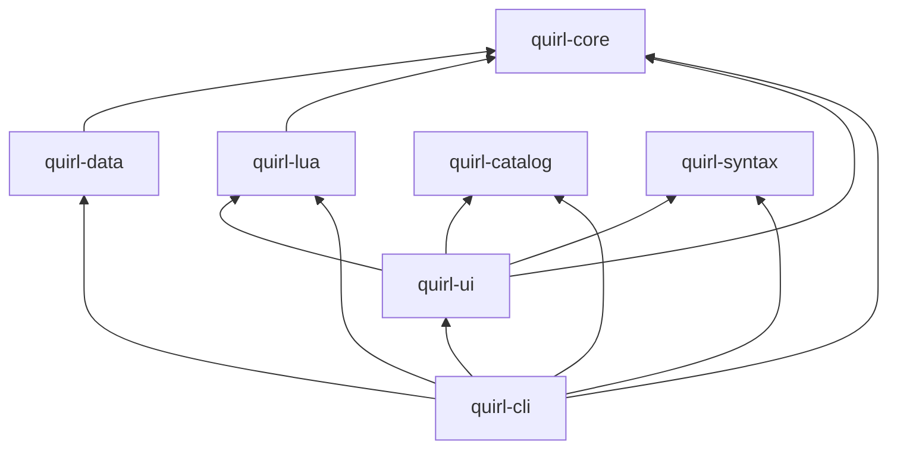

{/* Generated by website/scripts/sync-docs.mjs. Edit the repository source, not this copy. */}

- Status: Accepted
- Date: 2026-08-15
- Decision owners: Quirl maintainers
- Applies to: all workspace crates and dependency additions
- Superseded by: [ADR 0016](/docs/architecture/decisions/0016-runtime-layering-contract)

## Context

Quirl combines shell semantics, command metadata, parsing, typed data
pipelines, a sandboxed Lua runtime, terminal interaction, and application
composition. Without an explicit dependency direction, a UI or command-line
need can easily pull high-level concerns into reusable libraries, create
cycles, and make core behavior difficult to test independently.

The workspace also contains experimental engine spikes and benchmarking
tooling. Those serve different purposes from the product crates and must not
become back doors around the production dependency graph.

## Decision

The workspace uses a strict, one-way dependency graph. Functionality belongs
in the lowest layer that can own it.

- `quirl-core`, `quirl-catalog`, and `quirl-syntax` are foundation crates.
  They depend only on serde-level libraries and never on product layers.
- `quirl-data` and `quirl-lua` depend on `quirl-core` only among Quirl
  crates. They do not depend on each other.
- `quirl-ui` may depend on `quirl-catalog`, `quirl-core`, `quirl-lua`, and
  `quirl-syntax`.
- `quirl-cli` is the sole composition root and is the only crate permitted to
  see and assemble all product layers.
- `spikes/` remain separate Cargo workspaces. Their mutually exclusive or
  exploratory dependencies must not be added to the main workspace or imported
  by `crates/`.
- `quirl-bench` is research-only tooling (`publish = false`), not product
  code. Production crates must not depend on it.

## Consequences

Positive consequences:

- Shell semantics, diagnostics, syntax, and catalog metadata stay reusable
  without terminal or process concerns.
- Data and Lua features can be tested at their Rust boundaries without an
  interactive session.
- The terminal UI can present validated lower-layer state without defining
  language or execution semantics.
- Application wiring, filesystem integration, and process startup remain
  isolated to `quirl-cli`.
- Experimental runtimes cannot accidentally alter the production Lua 5.4
  dependency set.

Accepted costs:

- A feature may need an adapter in a higher layer instead of a convenient
  reverse dependency.
- Cross-cutting changes may touch several layers, with explicit data passed
  upward rather than shared through global state.
- Small abstractions sometimes need to be promoted downward before they can be
  reused.

## Enforcement

- Review every new Cargo dependency against this graph. Do not add a reverse
  edge merely to make an implementation compile.
- Keep the `ShellError` contract in `quirl-core` for fallible cross-crate
  paths; higher layers map presentation and process concerns around it rather
  than introducing parallel error types.
- Add commands and flags to `quirl-catalog`, Lua embedding only to
  `quirl-lua`, and terminal presentation only to `quirl-ui`.
- Treat workspace membership and crate dependency changes as architecture
  changes. Record intentional exceptions or graph changes in a new ADR.

## Revisit conditions

Revisit this decision only when a demonstrated product requirement cannot be
served by an adapter at an existing boundary, or when a new first-class layer
needs a stable, independently testable responsibility. Any change must retain
an acyclic graph, identify its composition owner, and be recorded in an ADR
before dependencies are inverted or a spike becomes product code.
